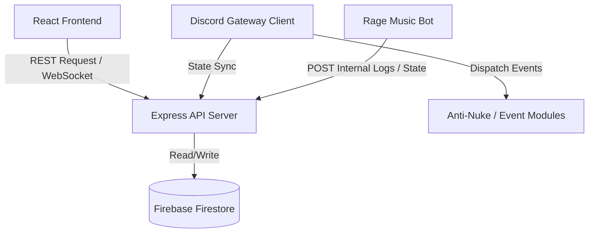

# Project Structure

This document outlines the folder layout and architectural boundaries of the Rage Optimiser codebase.

---

## 📂 Directory Layout

```
RAGE OPTIMISER/
├── backend/                  # Core bot backend & Express server
│   ├── src/
│   │   ├── core/             # Gateway client, registry, servers
│   │   ├── models/           # Database schemas
│   │   ├── modules/          # Module manifests and event handlers
│   │   ├── utils/            # Risk scoring, cryptography helpers
│   │   └── index.ts          # Main backend entry point
│   ├── package.json
│   └── tsconfig.json
│
├── clutch-music/             # Dedicated Voice Gateway bot (Music client)
│   ├── src/
│   │   ├── core/             # Music bot gateway overrides
│   │   ├── modules/music/    # Music playback commands & filters
│   │   └── index.ts          # Music bot entry point
│   ├── package.json
│   └── tsconfig.json
│
├── src/                      # React Frontend Dashboard SPA
│   ├── assets/               # Stylesheets, SVGs, static assets
│   ├── components/           # Common components (Modals, Tables, Forms)
│   ├── hooks/                # React custom hooks (useAuth, useSocket)
│   ├── pages/                # Page views (Security, Music, Stats, Verify)
│   ├── App.tsx               # Main application routing
│   └── main.tsx              # React mounting entry point
│
├── launcher/                 # Electron application shell wrapper
├── package.json              # Monorepo/Root package settings
└── tsconfig.json
```

---

## 🔄 Data Flow Overview


